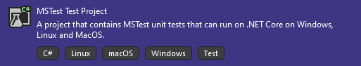

# Unittests

With unittests you can test a function. Its goal is, to find mistakes in functions e.g. if you try to divide by zero.

## Creating a Unittest with MSTest

### 1. Class / Project

In Visual Studio you can create a Test Project e.g. the MSTest:



It automatically contains a test class.
Every class containing at least one test must have the `[TestClass]` attribute.

### 2. Function

Now you can start by adding a test function. It's important to add the `[TestMethod]` attribute (keep in mind to use a [Naming Convention](#Naming-convention)).

A simple test function could look like this:

```csharp
[TestMethod]
public void Addition_inputPositiveNumbers_returnExpectedResult()
{
    // Arrange
    var arithmetics = new Arithmetics();

    // Act
    var actual = arithmetics.Addition(1, 2);

    // Assert
    Assert.AreEqual(3, actual);
}
```

A typical  test Function is divided into 3 sections:
- Arrange
- Act
- Assert

#### Arrange

In the Arrange section, you introduce variables which you need in the Act section.

#### Act

In the Act section, you call the function(-s) you want to test.

#### Assert

In the Assert section, you analyse the results. `Assert` provides many different functions for testing. E.g. `Assert.AreEqual(value1, value2)` which compares two values.

## DataRow

With `DataRow` you can test different parameters with the same function

```csharp
[TestMethod]
[DataRow("ABCDE", 3, "ABC")]
[DataRow("ABCDE", 5, "ABCDE")]
public void TruncateStringTest(string testString, int targetLength, string expectedValue)
{
    testString = testString.Truncate(targetLength);

    Assert.AreEqual(expectedValue, testString);
}
```

## Calling a test

If you have opened the Test Explorer (View/Test Explorer) you will see all the Tests. Now you can right-click a test and run it.

## Mocking (Moq)

With Mocks you can create an Object which can be used by the function. 
If you want to test the following function you need to have an `IShape` object:

```Csharp
public double CalculateVolume(IShape shape, double height)
{
    return shape.GetArea() * height;
}
```

Instead of Creating one you can create a mock:

```csharp
public void CalculateVolume_ZeroHeight_NoVolume()
{
    var testee = new Geometry();
    var shapeMock = new Mock<IShape>();
    shapeMock.Setup(mock => mock.GetArea()).Returns(10);

    var actual = testee.CalculateVolume(shapeMock.Object, 0d);
    Assert.AreEqual(0d, actual);
}
```

The mock object (`shapeMock`) is created first. Then with `Setup` you can add different methods and properties to the object. In this example, the function `GetArea()`, which returns `10`, is added to the mock object. 
Then the mock object is converted to an `IShape` object with `shapeMock.Object`.

## Naming convention

There are many different ways to name test functions mcs uses the following:

```csharp
public void [Funktionsname]_input[Input]_return[ExpectedResult]()
```

This is another one:

```csharp
public void [Funktionsname]_[Input]_[ExpectedResult]()
```

### Classes / Project

It is usefull to have the exact same arrangement for test classes and test projects as the one from the classes and projects to test.
You should also take the same names for the Files, just add `_test` at the end.
