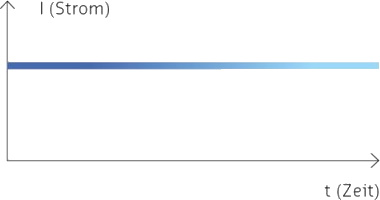
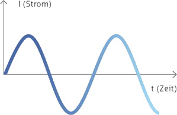
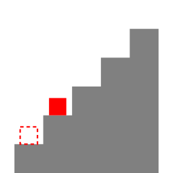
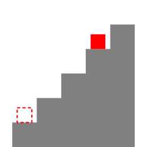
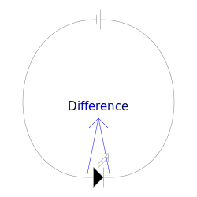
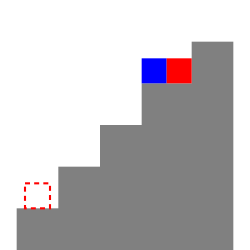

# Electric Units

In this chapter, we will take a look at the differences between AC and DC.

## DC Direct Current

DC is constant. This means, that it always flows from + to -. DC is usually used for devices with a battery or TVs

## AC Alternating Current

AC constantly changes its direction. The amount of repetitions (2 direction changes) per second is called Hertz (Hz). For example in Switzerland, it is 50Hz, which means it changes the direction 100 times a second. AC is usually used for everything with a motor, like a mixer. But a stove also needs AC power.

### Frequencies

As said before, Switzerland uses a frequency of 50Hz. Some
countries e.g. the USA use 60Hz.

A complete list of the different frequencies can be found here:

<https://en.wikipedia.org/wiki/Mains_electricity_by_country#Table_of_mains_voltages,_frequencies,_and_plugs>

But what happens if you plug a 50Hz device into a 60Hz plug?

If it is a DC device, it will convert the power, and it does not affect the function of the device. But if it is an AC device, it will run slightly faster and possibly even overheat and break.

#### Net Time

The net time is the time measured by the frequency of the AC power. E.g. ovens use it in the built-in clock. If the frequency is less than 50Hz, the net time is too slow. If it's more, the net time is too fast. The power distributors constantly try to keep the net time as close as possible to the actual time.

## Units

In this chapter, the different units of electricity are explained.

### Charge - Q

**Unit: C** - Coulomb

One coulomb is equal to $6,25\cdot 10^{18}$ elementary charges. One elementary charge is equal to the charge of one proton or to the negative charge of one electron. 

### Potential Energy In Classical Mechanics - E

**Unit: J** - Joule

**Formulas:**

$E=F\cdot d$

	
> $F$ is the force acting on the object. 
>
> $d$ is the distance the object was moved.

The potential energy is the energy difference of two states.

In this example, we have a stair, whose steps are 1m high, with a box of 100g and approximately 1N of weight force. We will take the first step as our first state. As a reference, it has a height of 0m. Therefore, the box has a potential energy of 0J ( $0\text{J}=1\text{N}\cdot 0\text{m}$ ):

If you move the cube up by one step, it now has a potential energy of 1J compared to the reference state:

On the third step the potential energy is 3J:

### Electric Potential Energy - UE

**Unit: J** - Joule

**Formulas:**

$U_E=k_e\frac{Q_1Q_2}{r}$

	
> $k_e$ is called the Coulomb constant. 
> Its value is $8,99\cdot 10^9\frac{\text{N}\cdot \text{m}^2}{\text{C}^2}$
> 
> $Q_1$ and $Q_2$ are the charges of two objects.
> 
> $r$ is the distance between the two objects.

Like the mechanical potential energy, the electric potential energy is the energy difference of two states.

Now that we understand the concept of potential energy in classical mechanics, we can go to the electric potential energy.
In the following picture, you can see an LED. In here we have two states, before and after the LED. The concept is the same as in the mechanical potential energy, we can compare the two states and get the potential energy:

### Voltage - U

**Unit: V** - Volt

**Formulas:**

$U=R\cdot I$

	
> $R$ is the resistance. 
> 
> $I$ is the current.

$U=\frac{U_E}{Q}$ 

	
> $U_E$ is the electric potential energy.
>
> $Q$ is the charge.

Voltage is the amount of potential energy per coulomb.
If we look at the example from before, we see that the cube has a potential energy of 3J:

If we take two cubes, we have a potential energy of 6J or a potential of 30J per kg:

Using that in electricity, we can substitute kg with C. That gives us the following formula: $U=\frac{U_E}{Q}$ or with Units: $\text{V}=\frac{\text{J}}{\text{C}}$

Another example would be a dam. The potential energy is the difference of all the water, the potential is the potential energy of 1kg.

### Resistance - R

**Unit: Ω** - Ohm

**Formulas:**

$R=\frac{U}{I}$

> $U$ is the voltage. 
> 
> $I$ is the current.

Resistance blocks a relative amount of the voltage. This is needed so that the voltage can be regulated and doesn't damage components. It can be compared to the thickness of a pipe, the thinner the pipe, the less water flows.

### Current - I

**Unit: A** - Ampere

**Formulas:**

$I=\frac{U}{R}$

	
> $U$ is the voltage. 
> 
> $R$ is the resistance.

Current is the amount of coulomb per second. You can compare it to the amount of water flowing through a pipe.

### Electric Power - P

**Unit: W** - Watt

**Formulas:**

$P=\frac{U_E}{t}$

	
> $U_E$ is the energy. 
> 
> $t$ is the time.

Electrical power is the amount of energy per second. You can compare it to the amount of potential energy of water per second.
