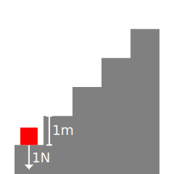
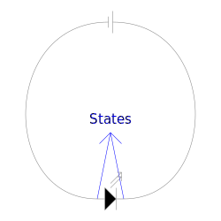

# Electric Units

In this chapter, we will take a look at the differences between AC and DC.

## DC Direct Current

DC is constant. This means, that it always flows from + to -. DC is usually used for devices with a battery or TVs

## AC Alternating Current

AC constantly changes its direction. The amount of repetitions (2 direction changes) per second is called Hz e.g. in Switzerland, it is 50Hz, which means it changes the direction 100 times a second. AC is usually used for everything with a motor, like a mixer. But a stove also needs AC power.

### Frequencies
As said before, Switzerland uses a frequency of 50Hz. Some
countries e.g. the USA use 60Hz.

A complete list of the different frequencies can be found here:

<https://en.wikipedia.org/wiki/Mains_electricity_by_country#Table_of_mains_voltages,_frequencies,_and_plugs>

But what happens if you plug a 50Hz device into a 60Hz plug?

If it is a DC device, it will convert the power, and it does not affect the function of the device. But if it is an AC device, it will run slightly faster. This doesn't have to do anything, but it can overheat and break.
#### Net Time
The net time is the time measured by the frequency of the AC power. E.g. ovens use it in the built-in clock. If the frequency is less than 50Hz, the net time is too slow. If it's more, the net time is too fast. The power distributors constantly try to keep the net time as close as possible to the actual time.
## Units
In this chapter, the different units of electricity are explained.
### Coulomb - Q
**Unit: C**

Minus one coulomb is equal to the amount of charge from 6,25 * 1018 electrons. Minus because a coulomb is positively charged, electrons negatively
### Potential Energy - UE
**Unit: J**

**Formulas:**

$U_E=k_e\frac{Q_1Q_2}{r}$

	
> $k_e$ is called the Coulomb constant. 
> Its value is $8,99\*10^9\frac{N\*m^2}{C^2}$
> 
> $Q_1$ and $Q_2$ are the charges of two objects.
> 
> $r$ is the distance between the two objects

Potential energy is the energy difference of two states.
#### Potential Energy - E
**Unit: J**

**Formulas**

$E=F*d$

	
> $F$ is the force acting on the object. 
>
> $d$ is the distance the object was moved

We first have to understand potential energy so that we can understand electric potential energy. 
**Example with gravity:**
In this example we have a stair (One Step is 1 m) with a box $F_g=1N$ ( $F_g$ means weight force). We will take the first step as our first state. As reference, it has a height of 0.

If you move the cube up one step, it now has a potential energy of 1J ( $1J=1N\*1M$ )

Now the potential energy is 3J.

#### Electric
Now that we understand the concept of potential energy we can go to the electric potential energy.
In the following picture you can see, that there is an LED. In here we have two states, before and after the LED. The concept is exaclty the same as in the potential energy.

### Voltage - U

**Unit: V**

**Formulas**

$U=R*I$

	
> $R$ is the resistance. 
> 
> $I$ is the current.

$U=\frac{U_E}{Q}$ 

	
> $U_E$ is the electric potential energy
>
> $Q$ is the charge.

Voltage is the amount of potential energy per coulomb.
If we look at the example from before, we see that the cube has a potential energy of 3J

If we take two cubes, we have a potential energy of 6J or 3J per cube. And that is the idea of voltage, Joule per Unit.

Using that in electricity, we can substitute the cube. It now is 1C, that gives us the following formula: $U=\frac{U_E}{Q}$ or with Units: $V=\frac{J}{C}$
### Resistance - R
**Unit: Ω**

Resistance blocks a relative amount of the voltage. This is needed so that the voltage can be regulated and doesn't damage components. It can be compared to a sieve, which slows down the water.
### Current - I
**Unit: A**

Current is the amount of coulomb per second.
### Electrical Power - P
**Unit: W**

Electrical power is the amount of energy per second.
